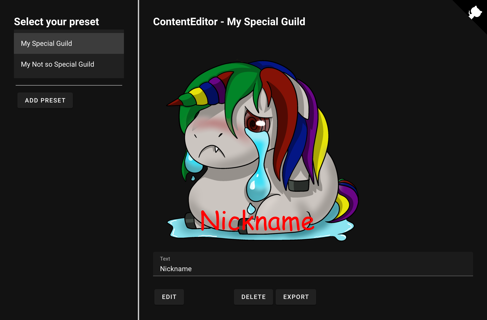
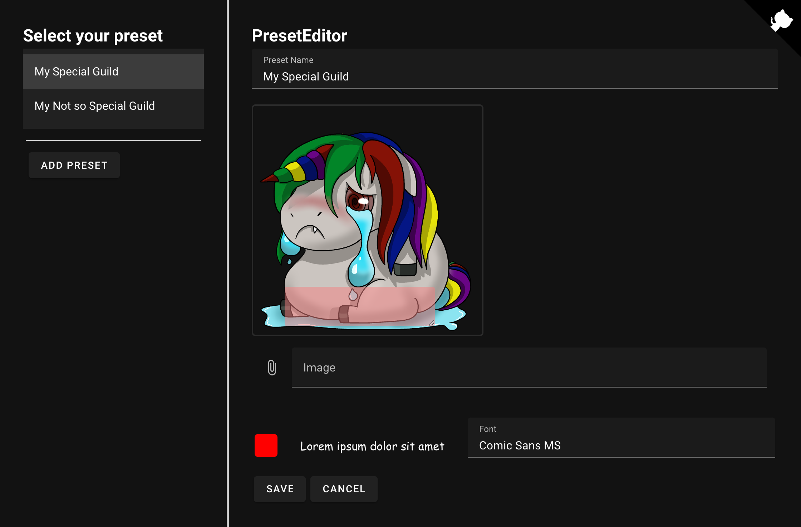

# GuildAvatars

With this project you can apply text to images. Everything is done locally in your browser no image data is sent to a server.

You can find a link to the project [here](https://h0rn0chse.github.io/GuildAvatars/).

 
 

 * Add text to the image.
 * Export the composed image.

 

 * Maintain avatar presets with image, font and font color.
 * Define a textbox and the text is fitted to its size.

## Libraries
 * Github Corners [github.com/YuskaWu/github-corner-element](https://github.com/YuskaWu/github-corner-element)
 * Text Fitting [github.com/STRML/textFit](https://github.com/STRML/textFit)
 * UI Framework [vuejs.org](https://vuejs.org/)
 * State Management [pinia.vuejs.org](https://pinia.vuejs.org/)
 * Component Library [next.vuetifyjs.com/en/](https://next.vuetifyjs.com/en/)
 * Packaging [vitejs.dev/](https://vitejs.dev/)
